# Creating a New Player

This guide will explain how to create a duplicate of the exisitng `sonic.tscn` object, along with
changing its spritesheet, and the UI graphics to go along with it! It's pretty simple and straightforward!

## Duplicating the Player Scene

First, you'll need to duplicate `sonic.tscn` itself.

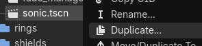

This is done simply by right-clicking on `sonic.tscn` (found at `res://objects/players`) and clicking **Duplicate** or
pressing `Ctrl + D` *(Windows)*.

For this guide, I have named my new player scene `newsonic.tscn`. You can name it however you'd like.

## Changing the Player Sprite

Changing the player sprite may be a confusing, but I assure you, it's nothing special.

To start, we would need a spritesheet that follows the same format as the pre-exisiting Sonic
spritesheet (a **10 x 11** tiled grid made up of **64px x 64px** tiles; this can be changed, but for simplicity's sake,
this guide will not cover how to do that).

**If you already have one, you can skip to the next section.**

To keep things simple, you can overlay your sprites on the provided Sonic spritesheet using any program of your choice.

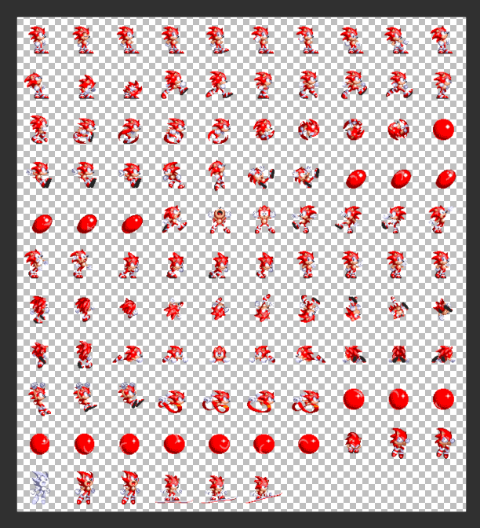

For the guide, I've made a modified version of the Sonic spritesheet, changing his signature blue to instead, a red that matches
the color of his shoes.

To stay organized, you can save this `.png` file of your spritesheet into `res://sprites/players`.

### Replacing the Blue Blur

Now, you can go back into your duplicated player scene and your first instinct may be to change the `texture` property
of the player's `Skin` node. However, while changes may reflect in the editor, it will not work in-game.

This is because the player's sprite is overidden by the texture given in the `player_texture` property, located
in the player's root node.

To properly change the player's sprite, click on the topmost node, which, by default, is named `Sonic`:

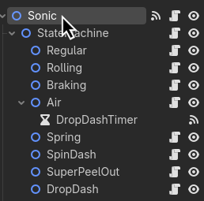

Then, on the right-hand side, you'll see the `Player` scene's properties:

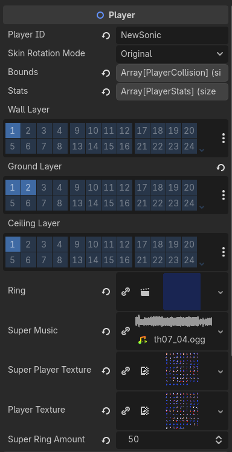

For this guide, the only thing we will need to touch is `player_texture`. You can simply drag and drop
your spritesheet from earlier into `player_texture`, and you're pretty much done!

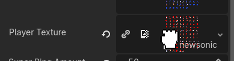

## Putting New Sonic on the Scene

To replace the player scene of the `Zone`, you can check out [the guide on how to set up zones](creating-a-zone.md#putting-sonic-on-the-runway), as
all you really need to do is instead of dragging and dropping `sonic.tscn`, you drag and drop
your new duplicated player scene.

After doing so, upon starting my game, I can now see that Sonic has turned red as expected!

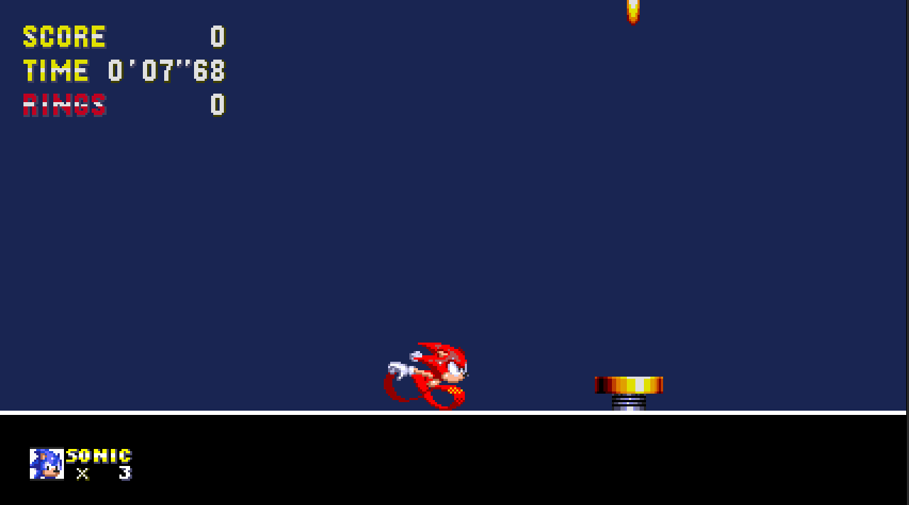

## Creating a New Player ID

For everything else in the game to properly identify just who you're actually playing as,
it uses the player's `player_id` variable!

That includes things like the UI, signposts, and even extra-life monitors!

If you don't want to just use Sonic's `player_id` or you want to keep Sonic as a playable character,
you're going to have to create a new `player_id`, so the game won't load the UI graphics for Sonic.

All you really need to do is to go into the player's properties,
and change the `player_id` to your name of choice! It can be anything, really.
For this guide, I'll be changing mine to `NewSonic`:

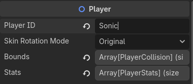
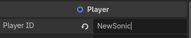

Now, when you start up the game, there'll be tons of warnings in the debugger:

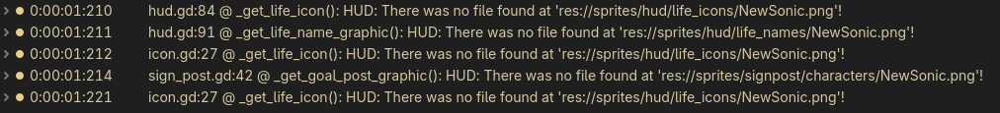

This is to be expected, since now, you're going to need to actually give the game graphics
to load for your character.

### Giving the Game Graphics: Life Icons

First up, there's the life icon.
It's the tiny little icon that shows up on the bottom left of the screen showing your player:

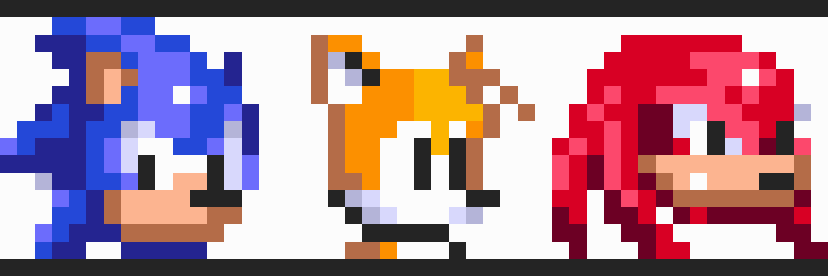

You're going to have to either **provide or create your own** using your software of choice!
Each life icon is **16x16px** each in size.
For example, I've created this very stylish icon for `NewSonic` that I'll be using:

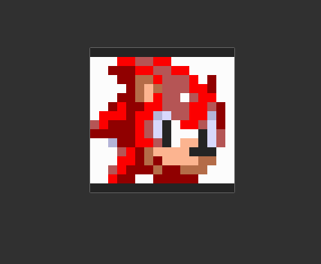

The convenient thing is, all you need to do is save this sprite into `res://sprites/hud/life_icons/`,
and make sure to name it **exactly** like your `player_id` (this includes upper/lowercase letters):

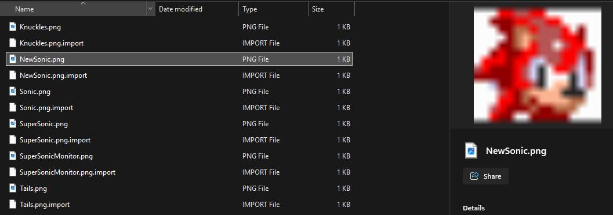

And that's the life icons finished! Now the monitors and UI will properly display your character's icon.

### Giving the Game Graphics: Life Names

"Life Name" is just a weird name I came up with for the graphic that displays
the player's name directly next to your player's life icon... <del>I'm open to better names.</del>

These sprites are stored in `res://sprites/hud/life_names/`.

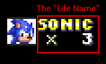

These sprites are **32x16px** each, and contain both the character's name and
that little **X** symbol at the bottom of the name.

For the guide, I've created my own right here by using the pre-exisiting ones in the folder:

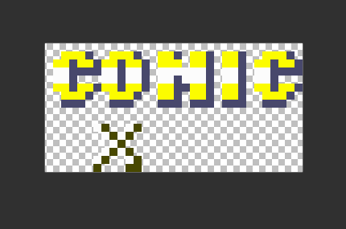

*It's not the most creative OC name, I know, but it'll work.*

You're going to be saving this sprite into `res://sprites/hud/life_names/`.
Just like your life icon, **make sure to name it exactly like your `player_id`.**

And with that, that's another graphic done!

### Giving the Game Graphics: Score Tally Graphic

When you finish a level in a Classic Sonic game, you're greeted with a score tally
screen. The part we'll be adding next is the character's name that goes
along with it:

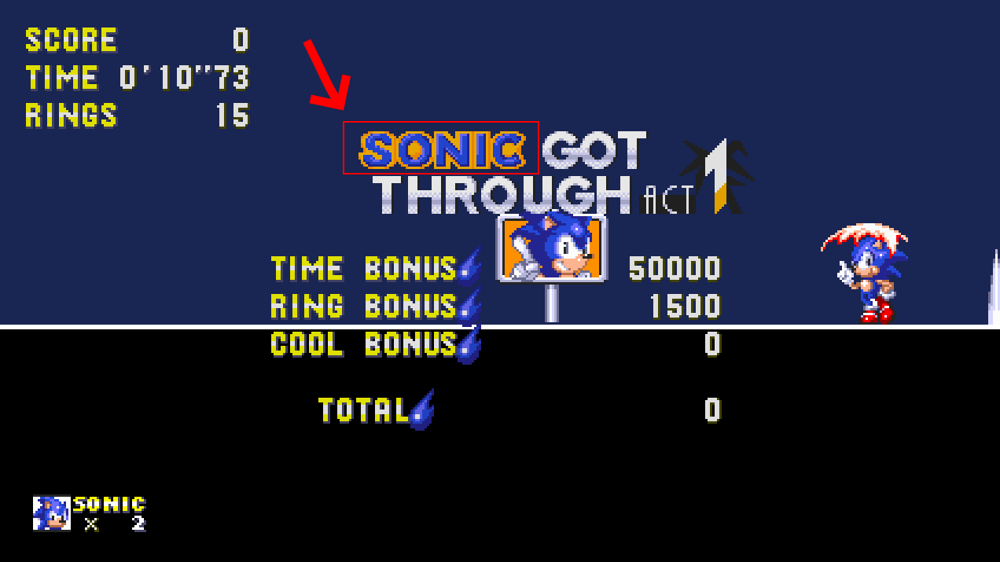

Each of these sprites are **116x16px**, and you'll want to make sure the actual name
part of the graphic is to the rightmost edge of the sprite, as shown here:

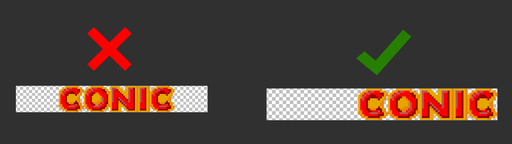

If I hadn't made it go to the rightmost edge, it would look something
like this in game:

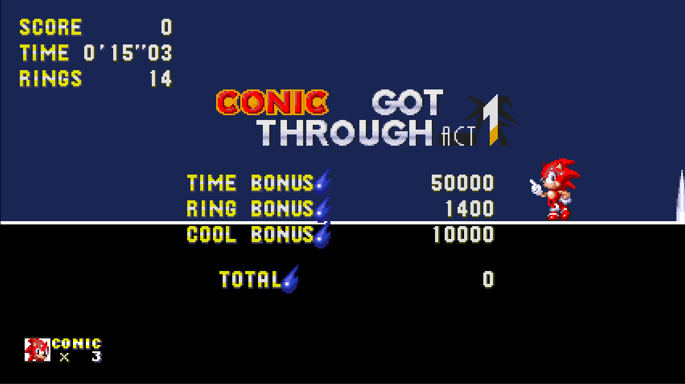

It doesn't look *bad* necessarily, though it looks unusually spaced apart from the rest of the
text. This is what it'd look like if I *had* made it go to the rightmost edge:

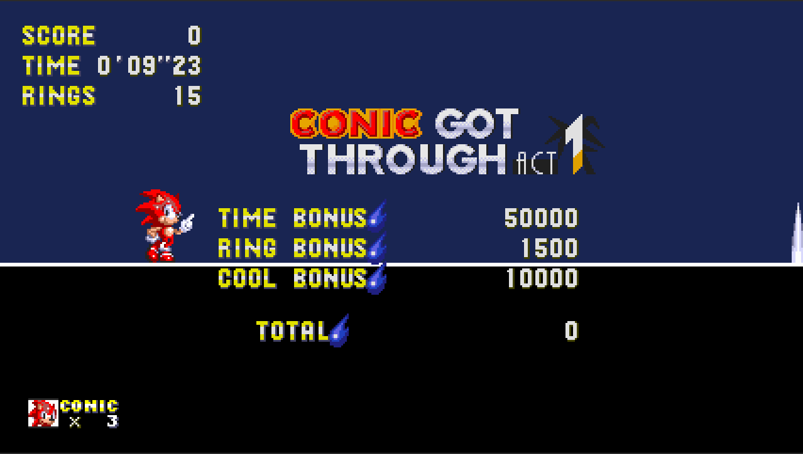

Of course, this is merely for aesthetics, so the game won't implode if you don't do this.

You'll want to save this sprite into `res://sprites/scoretally/names/`, and again,
just like the last two, **make sure to name it exactly like your `player_id`.**

With that, you'll be able to see your new player's name on the score tally screen!
Though, if you noticed on the screenshots... **the signpost graphics is missing!**

### Giving the Game Graphics: Sign Posts

For the final graphic, it's the sign post graphic!
Yeah, great segue, right?

To put it simply, it's the sprite shown after the sign post stops spinning when
you run past it:

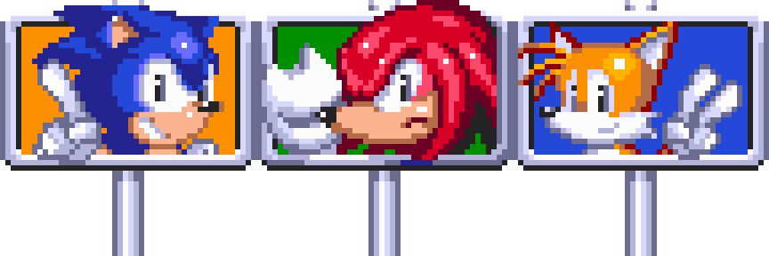

Each of these sprites are **48x48px**, and the ones used in the repository use
the ones from Sonic the Hedgehog 3 as a base.

I've made a signpost just for the guide, and it's what I'll be using:

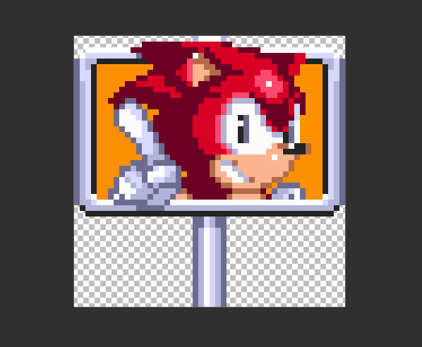

Now, all you need to do is save that sprite into `res://sprites/signpost/characters/`!

And if you've been following the guide up until now, I'm sure you already know what I'll say next:

**Make sure to name it exactly like your `player_id`.**

I just need to drill it into your head just to make sure, you know?
Can't have too many people asking me why their `.png`s aren't `.png`ing.

***

And with that, when we boot up a level and zoom through the signpost, we can see that
our custom character is complete! With the signpost, life icon, and everything else!

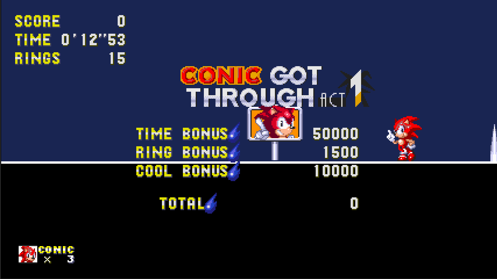

## FAQ

- **What happens if I save the sprites as something other than the size you specified?**
	- It probably wouldn't be the end of the world. I mean, the only reason why I specified
	those sizes is because the framework was built with those sizes in mind. I suppose going a little
	larger than them wouldn't be too bad, but these guides won't cover how to accommodate for that,
	since you *should* know enough Godot to be able to know how to do that.
- **What about their Super form?**
	- Super forms use shaders in order to change the color of the player's sprite. It's the same
	technique used in the Genesis games, and when the player is in their super form, it uses
	the `super_player_texture`. If you want to add a super form, you need to change the shader parameters
	of the player skin to match the colors of the player's fur (or whatever colors you would want
	to change), and along with that, you'd need to animate those shader parameters through the `PalletteSwapper`
	*(I know it's spelt wrong)*.
		- Do note that as of current, `original_2` and `replace_2` aren't actually used. Only
		`original_0`, `original_1`, and `original_3` (and their respective `replace` counterparts) are
		actually used for palette-switching, leaving a total of three colors for you to switch.
		- There may be plans to make this more straightforward, but that's not a top priority.
- **What about player-exclusive abilities?**
	- As of writing, there is no implementation of such system yet. There are obviously plans to,
	and it will begin with the implementation of Tails and Knuckles in the future. Once those are
	done, *then* I'll consider writing about them.
- **Is Godot case-sensitive to my filenames?**
	- Eh, it's a bit iffy on that. Sometimes it is, sometimes it's not. That's why you should just have
	a consistent capitalization style... *(I know the repository itself may not have one entirely, but it's getting there!)*

