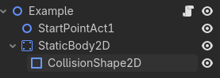

# Creating a Zone

In many Sonic the Hedgehog games, especially in the 2D entries, each level is most often referred to as a **zone**,
usually being split into two or three segments, each called an **act**.

However, in the context of GoSonic2DU, a `Zone` is a class that should be inherited by the root node of every playable
scene/level.

## Features

The `Zone` class is essentially the backbone of all operations going on in a single level.

It handles:

- Player initialization and spawning
- Camera setup and limits
- Act progression and transitions
- Level Music
- Title card display
- Cutscenes

If this framework was a high school class, the `Zone` class is that one person
everyone always goes to for advice. Unlike real life, it does not have any
feelings, so do not be afraid to rely on it.

## Initial Zone Setup

To create our first level, we would first need to create a scene that has a `Node2D` as its root node
(any node that inherited `Node2D` would work, but a regular `Node2D` is preferred for clarity):


We can save this scene into `res://scenes/zones/`. (You don't necessarily have to, but it's great
for organizing your scenes.)

Then, we would need to attach a script onto it.
To stay organized, you can save your zone's code into `res://scripts/zone/zones/`.
(You can name it however you'd like, but again, for organization's sake, the
zone's name is preferred.)

What we need to do now is inherit the `Zone` class. This will give our `Node2D` all of
the variables, functions, and all that magic needed for our level to properly function:

```gdscript
extends Zone

# Get rid of the initial "extends Node2D" Godot may give you.

```

And with that, you're done.

Well, with the initial setup, anyway.


Now, it may be a good time to look at what actually happened to our `Node2D`,
specifically, the newly added properties it gained.


## Zone Properties
Just taking a glance at the many properties this thing has to offer, you may notice
most properties have straightforward names, describing what function they serve.


To gain a better understanding of what these variables actually do,
we can take a look at each of them in their respective sections:

### Zone Info

| Property | Type | Description |
|----------|------|-------------|
| `zone_name` | String | This is the display name that will be shown in the title card (e.g., "Green Hill"). You do not need to add "Zone," as it will do that for you automatically. |
| `amount_of_acts` | int | This variable determines how many acts this zone will have. For example, most of the 2D Sonic games have two acts, so for that, you would set it to `2`. |
| `next_scene` | String | Here, you put in the path to the next scene that proceeds this zone. This will be the scene that will be loaded after the player finishes the zone. As a default, it is set to `res://scenes/title.tscn`. |
| `scripted_intro` | bool | This turns on the scripted intro feature of a `Zone`. Essentially, instead of proceeding with the normal zone intro, it skips it, and runs the function `custom_intro()` instead. *(This is explained in better detail in the Cutscenes section.)* |

### Resources

| Property | Type | Description |
|----------|------|-------------|
| `player_resource` | Resource | In here, you would typically insert `sonic.tscn`, or whatever player object you want the `Zone` to load. |

### Audio

| Property | Type | Description |
|----------|------|-------------|
| `zone_music` | AudioStream | This determines what `AudioStream` is requested to `MusicManager` when the function `_zone_music()` is called. |
| `victory_music` | AudioStream | This determines what music is played before the score tally upon finishing an act through a sign post. |

### Level Settings

| Property | Type | Description |
|----------|------|-------------|
| `starting_player_state` | String | This dropdown menu allows you to pick and choose which state the player starts in. It's set to `Regular` as a default, but you could make the player start in the `Dead` state for all I care. |

### Camera Limits

| Property | Type | Description |
|----------|------|-------------|
| `acts` | Array[CameraLimits] | This array is to be filled with `CameraLimits`, a resource that contains information on where the camera (and player) is bound to during a specific act. Index 0 is for the first act, index 1 is for the second, and so on. |
| `show_act` | int | This variable determines what act's boundaries are visually shown in the editor. This requires a `LimitsVisualizer` to be placed in your scene. |

Now, while most of these variables are incredibly important, you do not need to learn all of them
immediately. We can simply learn them in greater detail as we go on.

(Though, you should probably fill in `zone_name` with the name of your level. That should be pretty straightforward.)


## Putting Sonic on the Runway

Enough with all that technical mumbo jumbo—what about the Blue Blur himself?

Let's add our player object so that our `Zone` script can actually initialize something
when we start up our level.

To do that, we can drag and drop the already-existing Sonic player object
located in `res://objects/players/sonic.tscn`, right into the `<empty>`
Player Resource property of our scene's root node.


Now that we have told our `Zone` what player we want to load, the next thing we will
need is to tell it *where* to put our player when we start the scene.

Luckily, all we need to do is create another `Node2D` and simply name it `StartPointAct1`.


Wherever this node is placed on the scene, this will be where our player will be spawned
on the first act of the zone.

Now that's done, we can finally start up our scene and see what we've created!


Oh... that's right. We forgot to create an actual *surface* for the player to stand on. Unless, of course, you want to make
something like *Sonic Falls into a Bottomless Pit Forever: The Game*.

This is the part of the process where prior Godot experience will benefit you heavily (and is likely *needed*).

!!! warning
	Making a level using built-in Godot tools like `TileMapLayers` is **not**
	exclusive to the framework, therefore, it will not be covered in this guide. You will need to learn all
	of that on your own if you aren't already familiar with those concepts. 
	(Things that *are* framework-specific like creating loops for the player to run through will be covered later.)
	[*Direct link to the Godot Engine documentation.*](https://docs.godotengine.org/en/4.6/)

But I'll be nice and teach you how to create a *temporary* surface for our player to stand on anyway.
The level designing will be all up to you.

All you really need is a `StaticBody2D`, along with a `CollisionShape2D` inside of it:



Then afterwards, you can set its shape into a `RectangleShape2D`:


Resize it to how you see fit, perhaps something like this:

*(Don't forget toput your `StartPointAct1` on top of your surface!)*


Now, when you start up the scene, Sonic should look as if he's floating on thin air.


Congratulations! You've pretty much set up the bare basics of a `Zone`!

Though... it's a bit awkward lacking any tunes. You can fix that by dragging and dropping
either an `.ogg`, `.wav`, or `.mp3` file into the `zone_music` property.

If you don't have your own, you can use one of the framework's placeholder music
(chiptune renditions of some Touhou music) located at `res://audios/music/`. For
organization, you can put your own music files into there as well.


## Where to next?

Next, you should check out the basics of placing objects in your level!
[This guide](placing-zone-objects.md) will tell you all you need to know on how to go about doing so.